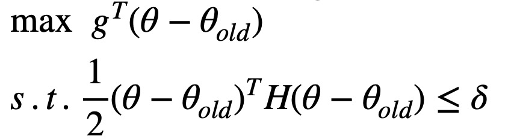

# TRPO 算法

算法的更新核心代码在 [trpo_step.py](trpo_step.py) 中。

这里写了很多主要是因为，TRPO 在本人的 DRL 学习过程中造成了较大的困扰.......

虽然从实现上和表现上，TRPO 已经可以被 PPO 替代，但从学习的角度来看它还是具有意义，
毕竟，如果连最简单的 VPG 都要学的话，TRPO 没有不学的道理。

## 1.理论推导

主要的理论都参考论文，具体的求解仍然需要进行数学推导（这就是TRPO不那么显然的地方），就是说，
你可能看了TRPO的论文，仍然不知道如何去实现它……

因此，你可能需要自己推导一份完整的问题求解，其优化目标求解主要是做近似（使用泰勒展式），然后求解
一个拉格朗日 K.K.T 条件。

这里给出一份完整的推导: [Deriviation of TRPO.pdf](Deriviation%20of%20TRPO.pdf)

## 2.核心实现

TRPO更新的核心代码在 [trpo_step.py](trpo_step.py) 文件中，带上一堆注释竟然快到200行了 : (，
如果能够实现 TRPO 算法，那么实现其他算法也就不在话下，毕竟这是（数学+代码）的双重考验。

即便你能做完第一步的数学推导，你仍然需要一些*数值优化*的基础，在具体的实现中仍然需要使用[Conjugate Gradient][1]
进行梯度方向求解 + [Line Search][2]进行步长搜索 ，其次需要使用`Vector-Product`对`Conjugate Gradient`进行
优化，同时你要能够熟练应用深度学习框架的自动求导工具，TRPO的实现不再依赖框架的自动梯度更新而是手动计算梯度并进行更新。

### 2.1 Value Net 更新

Value Net 的更新本质上就是最小化loss的过程，不过原始的深度学习框架使用的梯度下降更新速度较慢，这里使用[scipy.optimize.minimize][3]
进行梯度计算，(这里有一个坑，scipy优化器默认使用`float64`类型计算，因此`float32`可能会报错)，它能够迭代地最小化loss。

### 2.2 Policy Net 更新

Policy Net 的更新较复杂。其近似问题是:
<p float="center">
    
</p>


#### 1.计算目标函数的参数梯度 $g^{T}$

这里首先计算目标函数:
```python
 def get_loss(grad=True):
        log_probs = policy_net.get_log_prob(states, actions)
        if not grad:
            log_probs = log_probs.detach()
        ratio = torch.exp(log_probs - old_log_probs)
        loss = (ratio * advantages).mean()
        return loss
```
而其梯度就可以用`torch.autograd.grad()`函数求解:
```python
    loss = get_loss()
    loss_grads = autograd.grad(loss, policy_net.parameters())
    loss_grad = torch.cat([grad.view(-1) for grad in loss_grads]).detach()  # g.T
```
**为了方便起见，这里的梯度被拉成一维向量，后续的所有网络参数也都拉成一维。**

#### 2.使用 Conjugate Gradient 计算约束下的目标参数更新方向 $H^{-1}g$

对于问题: $H x = g$, 这里我们知道$H$是[KL-Divergence][4]的二阶[Hessian][5]矩阵，它的规模是整个Policy Net参数
的平方，存储 H 需要$O(N^2)$，使用`Vector Product`则不必存储$H$而直接计算$Hx$，求解 $H^{-1}$需要$O(N^{3})$，
而 CG 方法可以迭代地计算 $x = H^{-1} g$。

Vector Product使用如下函数计算:
```python
def Hvp(v):
    """
    compute vector product of second order derivative of KL_Divergence Hessian and v
    :param v: vector
    :return: \nabla \nabla H @ v
    """
    # compute kl divergence between current policy and old policy
    kl = policy_net.get_kl(states)
    kl = kl.mean()

    # first order gradient kl
    grads = torch.autograd.grad(kl, policy_net.parameters(), create_graph=True)
    flat_grad_kl = torch.cat([grad.view(-1) for grad in grads])

    kl_v = (flat_grad_kl * v).sum()  # flag_grad_kl.T @ v
    # second order gradient of kl
    grads = torch.autograd.grad(kl_v, policy_net.parameters())
    flat_grad_grad_kl = torch.cat([grad.contiguous().view(-1) for grad in grads]).detach()

    return flat_grad_grad_kl + v * damping
```

定义CG求解函数:
```python
def conjugate_gradient(Hvp_f, b, steps=10, rdotr_tol=1e-10):
    """
    reference <<Numerical Optimization>> Page 112
    :param Hvp_f: function Hvp_f(x) = A @ x
    :param b: equation
    :param steps: steps to run Conjugate Gradient Descent
    :param rdotr_tol: the threshold to stop algorithm
    :return: update direction
    """
    x = torch.zeros_like(b, device=device)  # initialization approximation of x
    r = - b.clone()  # Hvp(x) - b : residual
    p = b.clone()  # b - Hvp(x) : steepest descent direction
    rdotr = r.t() @ r  # r.T @ r
    for i in range(steps):
        Hvp = Hvp_f(p)  # A @ p
        alpha = rdotr / (p.t() @ Hvp)  # step length
        x += alpha * p  # update x
        r += alpha * Hvp  # new residual
        new_rdotr = r.t() @ r
        betta = new_rdotr / rdotr  # beta
        p = - r + betta * p
        rdotr = new_rdotr
        if rdotr < rdotr_tol:  # satisfy the threshold
            break
    return x
```
这里的实现与书本给出的算法完全一致。
```python
# conjugate gradient solve : H * x = g
# apply vector product strategy here: Hx = H * x
step_dir = conjugate_gradient(Hvp, loss_grad)  # approximation solution of H^(-1)g
```
这样就计算出了更新方向: $H^{-1} g$，
根据拉格朗日松弛方法，得到的完整更新方向是: $\sqrt{ \frac{2 \delta}{g^{T} H^{-1} g}} H^{-1} g$
```python
shs = Hvp(step_dir).t() @ step_dir  # g.T H^(-1) g; another implementation: Hvp(step_dir) @ step_dir
lm = torch.sqrt(2 * max_kl / shs)
step = lm * step_dir # update direction for policy nets
```

#### 3.使用 Line Search 搜索参数更新步长

数值优化问题的步长更新不一定满足单调性，这里给出一个更弱的条件 ———— Sufficient Condition
对一个最小化问题: $ min_{x} f(x) $, 对应的 Sufficient Condition :

$$ f(x_{k} + \alpha p_{k}) \leq f(x_{k}) + c {\nabla f(x_{k})}^{T} \alpha p_{k}$$

，其中 $c \in (0, 1)$ ，是一个参数，这里取 `0.1`。

Line Search即搜索最优的$\alpha$，具体的实现代码如下:

```python

def line_search(model, f, x, step_dir, expected_improve, max_backtracks=10, accept_ratio=0.1):
    """
    max f(x) <=> min -f(x)
    line search sufficient condition: -f(x_new) <= -f(x) + -e coeff * step_dir
    perform line search method for choosing step size
    :param step_dir: direction to update model parameters
    :param expected_improve: {\nabla f(x_{k})}^{T} p_{k}$
    :param max_backtracks:
    :param accept_ratio:
    :return:
    """
    f_val = f(False).item()

    for step_coefficient in [.5 ** k for k in range(max_backtracks)]:
        x_new = x + step_coefficient * step_dir
        set_flat_params(model, x_new)
        f_val_new = f(False).item()
        actual_improve = f_val_new - f_val
        improve = expected_improve * step_coefficient
        ratio = actual_improve / improve
        if ratio > accept_ratio:
            return True, x_new
    return False, x
```
最后将其搜索结果作为网络参数，更新 Policy Net。

[1]: https://en.wikipedia.org/wiki/Conjugate_gradient_method
[2]: https://en.wikipedia.org/wiki/Backtracking_line_search
[3]: https://docs.scipy.org/doc/scipy/reference/generated/scipy.optimize.minimize.html
[4]: https://en.wikipedia.org/wiki/Kullback%E2%80%93Leibler_divergence
[5]: https://en.wikipedia.org/wiki/Hessian_matrix
