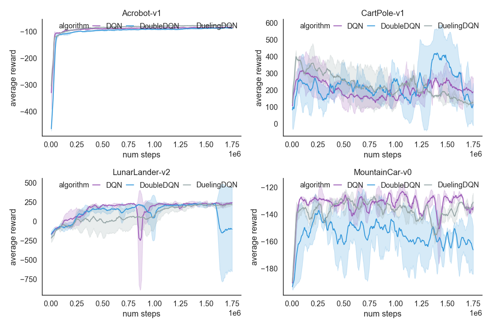
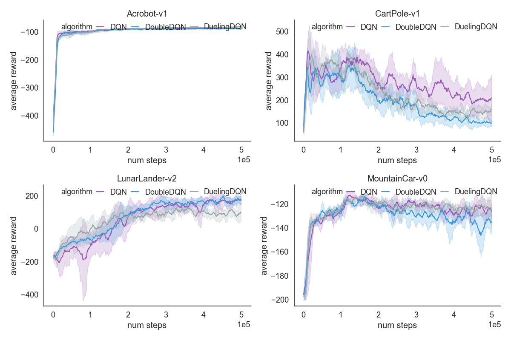
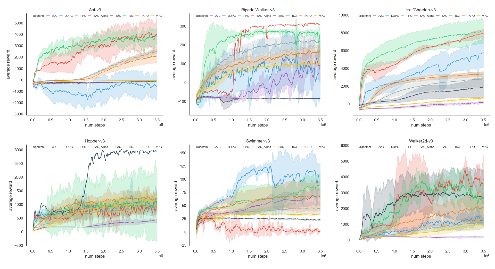
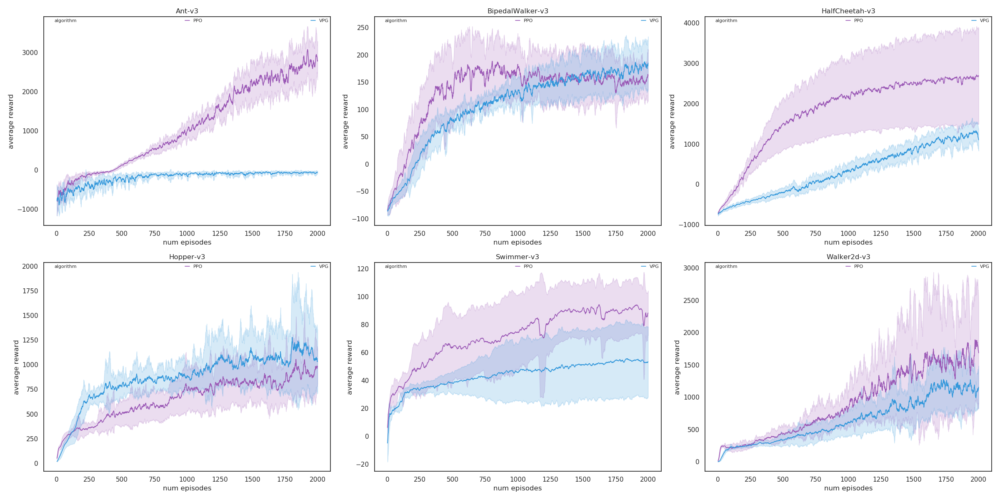

# About Deep Reinforcement Learning

The combination of Reinforcement Learning and Deep Learning produces a series of important algorithms. This project will focus on referring to 
relevant papers and implementing relevant algorithms as far as possible. 

This repo aims to implement Deep Reinforcement Learning algorithms using [Pytorch](https://pytorch.org/) and [Tensorflow 2](https://www.tensorflow.org/).


## 1.Why do this?

- Implementing all of this algorithms from scratch really helps you with your **parameter tuning**; 
- The coding process allows you to **better understand** the **principles** of the algorithm.

## 2.Lists of Algorithms

### 2.1 Value based

Value based algorithms include **DQNs**.

[1]. DQN [Pytorch](Algorithms/pytorch/DQN) / [Tensorflow](Algorithms/tf2/DQN), Paper:  [Playing Atari with Deep Reinforcement Learning](https://arxiv.org/abs/1312.5602)  
[2]. Double DQN [Pytorch](Algorithms/pytorch/DoubleDQN) / [Tensorflow](Algorithms/tf2/DoubleDQN),  Paper: [Deep Reinforcement Learning with Double Q-learning](https://arxiv.org/abs/1509.06461)  
[3]. Dueling DQN [Pytorch](Algorithms/pytorch/DuelingDQN) / [Tensorflow](Algorithms/tf2/DuelingDQN), Paper: [Dueling Network Architectures for Deep Reinforcement Learning](https://arxiv.org/abs/1511.06581)   


### 2.2 Policy based

Policy based algorithms is currently perform better, including **Policy Gradient Methods**.

[1]. REINFORCE [Pytorch](Algorithms/pytorch/REINFORCE) / [Tensorflow](Algorithms/tf2/REINFORCE), Paper: [Policy Gradient Methods for Reinforcement Learning with Function Approximation](https://papers.nips.cc/paper/1713-policy-gradient-methods-for-reinforcement-learning-with-function-approximation.pdf)  
[2]. VPG(Vanilla Policy Gradient) [Pytorch](Algorithms/pytorch/VPG) / [Tensorflow](Algorithms/tf2/VPG), Paper: [High Dimensional Continuous Control Using Generalized Advantage Estimation](https://arxiv.org/abs/1506.02438)  
[3]. A2C [Pytorch](Algorithms/pytorch/A2C), Paper: [Asynchronous Methods for Deep Reinforcement Learning](https://arxiv.org/abs/1602.01783) Synchronous version of A3C  
[4]. DDPG [Pytorch](Algorithms/pytorch/DDPG), Paper: [Continuous Control With Deep Reinforcement Learning](https://arxiv.org/abs/1509.02971)  
[5]. TRPO [Pytorch](Algorithms/pytorch/TRPO) / [Tensorflow](Algorithms/tf2/TRPO), Paper: [Trust Region Policy Optimization](https://arxiv.org/abs/1502.05477)  
[6]. PPO [Pytorch](Algorithms/pytorch/PPO) / [Tensorflow](Algorithms/tf2/PPO), Paper: [Proximal Policy Optimization Algorithms](https://arxiv.org/abs/1707.06347)  
[7]. SAC [Pytorch](Algorithms/pytorch/SAC), Paper: [Soft Actor-Critic: Off-Policy Maximum Entropy Deep Reinforcement Learning with a Stochastic Actor](https://arxiv.org/pdf/1801.01290.pdf)  
[8]. SAC with Automatically Adjusted Temperature [Pytorch](Algorithms/pytorch/SAC_Alpha), Paper: [Soft Actor-Critic Algorithms and Applications](https://arxiv.org/pdf/1812.05905.pdf)  
[9]. TD3(Twin Delayed DDPG) [Pytorch](Algorithms/pytorch/TD3), Paper: [Addressing Function Approximation Error in Actor-Critic Methods](https://arxiv.org/abs/1802.09477)  
    

### 2.3 Imitation Learning

Imitation learning learn from expert data.

[1]. GAIL [Pytorch](Algorithms/pytorch/GAIL), Paper: [Generative Adversarial Imitation Learning](https://arxiv.org/pdf/1606.03476.pdf)     


## 3.Project Dependencies

- Python >=3.6  
- Tensorflow >= 2.4.0
- Pytorch >= 1.5.0  
- Seaborn >= 0.10.0  
- Click >= 7.0  

Full dependencies are listed in the [requirements.txt](requirements.txt) file, install with pip:

```bash
pip install -r requirements.txt
```

You can install the project by typing the following command:

```bash
python install -e .
```

## 4.Run

Each algorithm is implemented in a single folder including `4` files:

```text
1. main.py # A minimal executable example for algorithm  

2. [algorithm].py # Main body for algorithm implementation  

3. [algorithm]_step.py # Algorithm update core step 

4. test.py # Loading pretrained model and test performance of the algorithm

````

The default `main.py` is a an executable example, the parameters are parsed by [click](https://click.palletsprojects.com/en/7.x/).

You can run algorithm from the  `main.py` or `bash scripts`. 
- You can simply type `python main.py --help` in the algorithm package to view all configurable parameters. 
- The directory [Scripts](Scripts) gives some bash scripts, you can modify them at will.

## 5.Visualization of performance

[Utils/plot_util.py](Utils/plot_util.py) provide a simple plot tool based on `Seaborn` and `Matplotlib`.
All the plots in this project are drawn by this plot util.

### 5.1 Benchmarks for DQNs

#### **Pytorch Version**



#### **Tensorflow2 Version**



 
### 5.2 Benchmarks for PolicyGradients

#### **Pytorch Version**



#### **Tensorflow2 Version**

Currently only `VPG`, `PPO` and `TRPO` Available:


